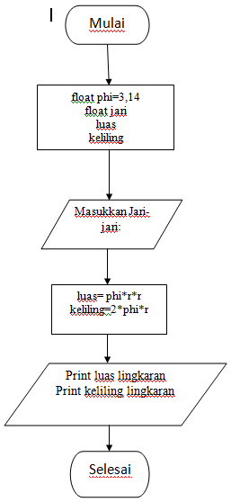
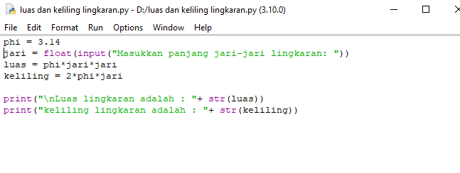
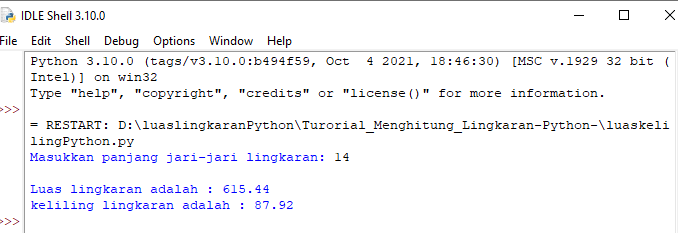

# Turorial_Menghitung_Lingkaran-Python-
### 1. Flowchart

Rumus luas lingkaran adalah phi*r*r dan rumus keliling lingkaran adalah 2*phi*r dengan phi bernilai 3,14

### 2. Coding Python Luas dan Keliling Lingkaran

Buatlah program dengan nilai "phi =3.14" dan isi jari dengan float (float adalah bilangan desimal) dan jangan lupa input untuk mengisi nilai sesuai yang user mau. Luas adalah rumus luas lingkaran dan keliling adalah rumus keliling lingkaran. setelah itu jangan lupa menggunakan print (print digunakan untuk menampilkan sesuatu yang diproses) jangan lupa menambahkan "+str" karna kita menggabungkan beberapa nilai/karakter.

### 3. Output Hasil Program

Dan hasil program tinggal mengisi nilai jari-jari yang ingin dimasukkan dan program otomatis terhitung ke luas dan keliling lingkaran

### Selesai